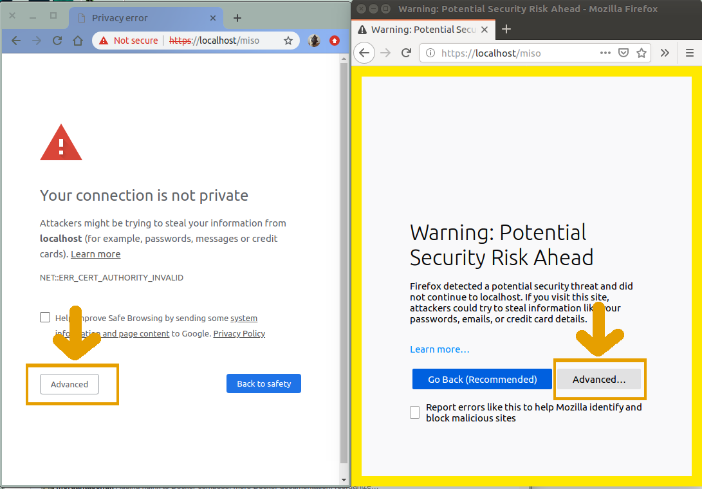
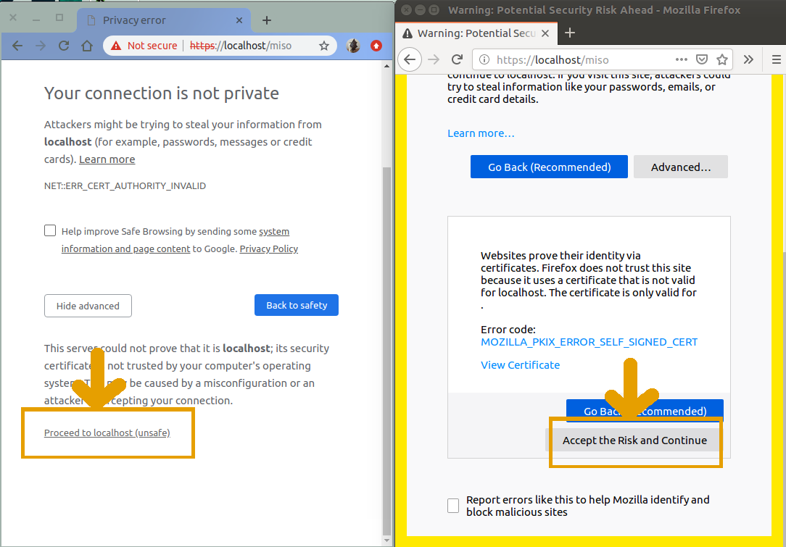

# Installing MISO with docker-compose

This getting started guide should be all you need to do to get a demonstration
version of MISO running on your operating system, provided you can install and
use Docker. If you want to install MISO without using Docker, please see the
[baremetal installation guide](../baremetal-installation-guide).

These compose files included in the MISO distribution are intended as a
demonstration and __not a permanent installation__. To customize the behaviour
of these compose files to be suitable for production systems, look at the
[Overview](#overview) and [Recipes](#recipes) sections below.


## Prerequisites

Install required dependencies:

1. [Install Docker 18.06.0+](https://docs.docker.com/install/)
1. If necessary, [install Docker Compose](https://docs.docker.com/compose/install/)


Download and extract the `.docker` directory from Github into `miso-lims-compose`.

```
mkdir miso-lims-compose
wget https://github.com/miso-lims/miso-lims/archive/master.zip
unzip master.zip 'miso-lims-master/.docker/*'
mv miso-lims-master/.docker/* miso-lims-compose
rm -r master.zip miso-lims-master/
```

You are now ready to run MISO.

## Quick Start

To bring up a demo environment, install the pre-requisites above and run the
following commands.

**Plain sample mode** has a straightforward Sample -> Library -> Library Aliquot ->
Pool workflow and is sufficient for basic laboratory tracking for sequencing.

Launch the plain sample demo with docker-compose:
```bash
cd miso-lims-compose
# configuration
export MISO_DB_USER=tgaclims MISO_DB=lims MISO_DB_PASSWORD_FILE=./.miso_db_password MISO_DB_ROOT_PASSWORD_FILE=./.miso_root_password MISO_TAG=latest
# create the password files specified above
echo "changeme" > ./.miso_db_password
echo "changeme" > ./.miso_root_password
# run
docker-compose -f demo.plain.yml up
```

**Detailed sample mode** has all of the features of plain sample mode, plus it
allows users to build a hierarchy of Samples (e.g. Identity -> Tissue -> Slide
-> gDNA (stock) -> gDNA (aliquot) and also includes alias autogeneration.

Launch the detailed sample demo with docker-compose:
```bash
cd miso-lims-compose
# configuration
export MISO_DB_USER=tgaclims MISO_DB=lims MISO_DB_PASSWORD_FILE=./.miso_db_password MISO_DB_ROOT_PASSWORD_FILE=./.miso_root_password MISO_TAG=latest
# create the password files specified above
echo "changeme" > ./.miso_db_password
echo "changeme" > ./.miso_root_password
# run
docker-compose -f demo.detailed.yml up
```

For both environments, navigate to [http://localhost](http://localhost)
and use the credentials **admin**/**admin**.

Once you are finished with the container, make sure to run
`docker-compose -f <compose.yml> down`, where `<compose.yml>` is either
`demo.plain.yml` or `demo.detailed.yml`. This will clean up the instances and
networks and release their resources to the host operating system.


## Overview

The MISO Docker containers consist of four parts:

**MySQL database**. The database. We use the
[MySQL official Docker container](https://hub.docker.com/_/mysql).

**Apache Tomcat server**. The actual server for the MISO webapp. The image is
[miso-lims-webapp](https://github.com/miso-lims/miso-lims/pkgs/container/miso-lims-webapp)
container, based on the
[official Tomcat alpine container](https://hub.docker.com/_/tomcat).

**Flyway DB migration**. Initializes or updates the database.
This is miso-lims's
[miso-lims-migration](https://github.com/miso-lims/miso-lims/pkgs/container/miso-lims-migration)
container (_[Dockerfile](https://github.com/miso-lims/miso-lims/blob/master/Dockerfile),
target `flyway-migration`_), based on [boxfuse/flyway](https://hub.docker.com/r/boxfuse/flyway). It will initialize or update the MySQL database for a particular MISO
version.

**Nginx reverse proxy**. Redirects traffic from port 80 to MISO's 8080 address,
and is also required for HTTPS. We use the official [nginx](https://hub.docker.com/_/nginx) container.

## Installing MISO for production use

The current docker-compose files emphasize that they are not for production use.
So, how do you configure MISO for production?

We suggest the following:

1. Mount the MySQL database and MISO files storage location to permanent, backed-up locations (see [Adding Persistent Storage](#adding-persistent-storage)).
3. Pre-load desired data (if any) by binding SQL files to the flyway container (see [Pre-loading data with Flyway](#pre-loading-data-with-flyway).
4. Modify and mount the miso.properties file to have your desired configuration (see [Modifying the miso.properties file](#modifying-the-misoproperties-file).
5. Change the username and password for the database using the environmental variables.
6. Enable HTTPS (see [Configuring HTTPS](#configuring-https)). SSL is required to connect to MISO
over a network.

## Upgrading to new versions

You can upgrade to a newer version of MISO simply by switching to a newer version of the Docker images. Be sure to check the release notes to see if there are any additional steps you should take for a particular version upgrade. A database migration will occur when you start up the Flyway container, so it is always best to backup your database before an upgrade. When you start up the new version, keep an eye on the output from the Flyway container to ensure that the migration completes successfully.

## Recipes

We provide a number of solutions to common issues so you can construct your
own docker-compose files.

### Adding persistent storage

There are two ways to add persistent storage: Docker volumes and bind mounts. In
both cases, you will mount a volume or bind a filesystem location to
`/var/lib/mysql` inside the MySQL container, and to `/storage/miso/files/`
inside the webapp container.

#### Docker volumes

Docker volumes can be used for testing and semi-permanent demonstrations, when
you don't want to lose all of your data between restarts.

First ensure that the docker-compose file is working
correctly before adding persistent storage. Otherwise you risk corrupting your
database.

Then modify the docker-compose.yml file with the following:

``` yaml
...
services:
  db:
    volumes:
      - "misolims_db:/var/lib/mysql"
  webapp:
    volumes:
      - "misolims_files:/storage/miso/files/"
...
volumes:
  misolims_db:
  misolims_files:
```

#### Filesystem mount

For permanent, production use, we recommend binding a location on the host
filesystem for the database and file storage.

First ensure that the docker-compose file is working correctly before adding
persistent storage. Otherwise you risk corrupting your database.

Then modify the docker-compose file with the following, where `/path/to` and
subdirs are locations on the host filesystem:

``` yaml
...
services:
  db:
    volumes:
      - "/path/to/mysql/db:/var/lib/mysql"
  webapp:
    volumes:
      - "/path/to/files:/storage/miso/files/"
```

### Pre-loading data with Flyway

Starting MISO with an entirely empty database will not provide full functions.
The demo database starts with some pre-loaded information that may or may not be
useful: see the SQL files
[here](https://github.com/miso-lims/miso-lims/tree/master/.docker/detailed_sample_config).

We recommend including the V0792 migration to
clean out the database and modifying V0793 as appropriate for your institution.
All SQL migrations that conform with Flyway's `V####__name.sql` naming scheme
will be automatically run in numerical order when mounted at `/flyway/sql`
inside the container.


``` yaml
...
services:
  flyway:
    volumes:
      - type: bind
        source: "./V0792__drop-inconvenient-rows.sql"
        target: "/flyway/sql/V0792__drop-inconvenient-rows.sql"
      - type: bind
        source: "./V9000__institution-custom.sql"
        target: "/flyway/sql/V9000__institution-custom.sql"
...
```

See the [Type Data](../../user_manual/type_data/) section of the [User Manual](../../user_manual/)
for more information on the types of data that can be added at this stage.

### Modifying the miso.properties file

The
[miso.properties](https://github.com/miso-lims/miso-lims/blob/master/miso-web/src/main/resources/internal/miso.properties)
file has plenty of options to configure for site-specific use. See [Site Configuration](../site-configuration) for more
information.

This file should be mounted in the webapp container at
`/usr/local/tomcat/conf/Catalina/localhost/miso.properties`.

``` yaml
...
services:
  webapp:
    volumes:
      - type: bind
        source: "./.docker/detailed_sample_config/miso.properties"
        target: "/usr/local/tomcat/conf/Catalina/localhost/miso.properties"
...
```

### Configuring HTTPS

In order to turn on HTTPS for MISO, configure the nginx container to accept
incoming connections from port 443, include the SSL certificate, key, and
password, and bind a new configuration file.

The first file necessary is the nginx configuration file, which can be found at
[.docker/nginx/ssl.conf](https://github.com/miso-lims/miso-lims/blob/develop/.docker/nginx/ssl.conf).

The configuration below redirects requests from port 80 (http://...) to port 443
(https://...) and then defines the locations of the ssl password file, ssl
certificate, and certificate key. These locations are important since we will
have to bind the appropriate files into them through the compose file.

```
server {
    listen 80;
    location / {
        return 301 https://$host$request_uri;
    }    
}

server {
  listen 443 ssl;
  listen [::]:443 ssl;

  ssl_password_file /run/secrets/ssl_password;
  ssl_certificate /etc/nginx/ssl/cert.pem;
  ssl_certificate_key /etc/nginx/ssl/key.pem;

  # If deploying (uploading) war files configure nginx to accept large files from clients
  client_max_body_size 100M;
  location / {
      proxy_set_header X-Forwarded-Host $host;
      proxy_set_header X-Forwarded-Server $host;
      proxy_set_header X-Forwarded-For $proxy_add_x_forwarded_for;
      # assumes this is running in docker compose with DNS name 'webapp' pointing to miso
      proxy_pass http://webapp:8080;
  }
}
```


#### Using a previously-generated security certificate

In the first case, you have a security certificate and key that you want to use
with your MISO instance. You can request a certificate for your server from
your local IT department or from a service such as
[Let's Encrypt](https://letsencrypt.org/).

In the snippet below, the SSL certificate and key file are located at `./cert.pem`
and `./key.pem` respectively, and the SSL certificate password is located in a
file located at the environment variable `${SSL_PASSWORD_FILE}`. We also bind
port 443 on the nginx container to the host machine.

Make sure the target locations of the certificate, certificate key, and password
match those specified in the `ssl.conf` file above.

```yaml
secrets:
  ssl_password:
    file: ${SSL_PASSWORD_FILE}

services:
  nginx:
    image: nginx:1.15.12-alpine
    ports:
      - "80:80"
      - "443:443"
    secrets:
      - ssl_password
    volumes:
      - type: bind
        source: "./.docker/nginx/ssl.conf"
        target: "/etc/nginx/conf.d/default.conf"
      - type: bind
        source: "./cert.pem"
        target: :/etc/nginx/ssl/cert.pem"
      - type: bind
        source: "./key.pem"
        target: :/etc/nginx/ssl/key.pem"
    links:
      - webapp
    depends_on:
      - webapp
```

As before, navigate to [http://localhost](http://localhost). You will
be automatically redirected to the login page at https://localhost/miso and can
use **admin**/**admin** to log in.


#### Creating a self-signed certificate on startup

If you don't have a certificate or you are testing, you may want to generate a
self-signed certificate on startup for MISO to use.

We provide an example script for this purpose at
[.docker/nginx/self-sign-cert.sh](https://github.com/miso-lims/miso-lims/blob/develop/.docker/nginx/self-sign-cert.sh.conf). Copy and modify the `-subj` field as appropriate for your
organization.
The SSL password is still required and used to generate the certificate, and we
additionally modify the command to generate the certificate as the container is
starting.

``` yaml
secrets:
  ssl_password:
    file: ${SSL_PASSWORD_FILE}

services:
  nginx:
    image: nginx:1.15.12-alpine
    ports:
      - "80:80"
      - "443:443"
    secrets:
      - ssl_password
    volumes:
      - type: bind
        source: "./.docker/nginx/ssl.conf"
        target: "/etc/nginx/conf.d/default.conf"
      - type: bind
        source: "./.docker/nginx/self-sign-cert.sh"
        target: "/self-sign-cert.sh"
    links:
      - webapp
    depends_on:
      - webapp
    command: ["sh", "-c", "./self-sign-cert.sh; nginx -g 'daemon off;'"]
```

As before, navigate to [http://localhost](http://localhost). You will
be automatically redirected to the login page at https://localhost/miso and can
use **admin**/**admin** to log in.

The container creates a new self-signed certificate every time it starts up for
security reasons: otherwise everyone would use the same certificate, leading to
potential trust issues. If you would like to download the certificate for re-use, the files are located at `/etc/nginx/ssl/cert.pem` and `/etc/nginx/ssl/key.pem` in the nginx container, and then follow the steps in [using a previously-generated security certificate](#using-a-previously-generated-security-certificate).

##### Browser security warnings

With self-signed certificates, you will likely get security warnings on Chrome
or Firefox when you go to [https://localhost](https://localhost).
Since you set up the certificate and you (hopefully) trust yourself, these
warnings can be ignored. Your data is still protected despite the browser's
warning.

Here is what your browser will look like, with Chrome on the left and Firefox on
the right. To ignore the errors, click the _Advanced_ button on either page.



Then click either "Proceed to localhost (unsafe)" or "Accept the Risk and
Continue".



The process for [handling self-signed certificates on Internet Explorer or Edge](https://medium.com/@ali.dev/how-to-trust-any-self-signed-ssl-certificate-in-ie11-and-edge-fa7b416cac68)
is very similar. Follow the accepted process for trusting self-signed
certificates.


### Building and running from source

If you are developing MISO or want to use the MISO code from a particular
commit, modify the compose file to build the MISO-specific containers from
source.

There are two compose files in the main miso-lims source intended for
developers:

* docker-compose.detailed.yml : builds and starts detailed sample demo mode
* docker-compose.plain.yml : builds and starts plain sample demo mode

The main difference between this and the demo versions it that the two
containers `flyway` and `webapp` are built using targets in the
[Dockerfile](https://github.com/miso-lims/miso-lims/blob/master/Dockerfile).

Both assume that you are working in the fully cloned miso-lims repository.
First, clone the `miso-lims` source repository from  
([miso-lims](https://github.com/miso-lims/miso-lims)) Github and git checkout
the version, branch, or release that you are working on. Then build the compose
file, and run the version as usual.

```
# check out the MISO source and switch to release version v0.2.174
git clone https://github.com/miso-lims/miso-lims.git
git checkout tags/v0.2.177 -b v0.2.177

# compose.yml is one of the two compose files above
docker-compose -f compose.yml build
docker-compose -f compose.yml up
```

The URL [http://localhost](http://localhost) is still where to go and
log in with the credentials **admin**/**admin**.

#### Improving build times while developing

For faster startup, you may interested in
[adding persistent storage](#adding-persistent-storage) so that the database
doesn't re-populate on every startup. This drops the startup time
from ~1 minute to about 20 seconds.

**Be cautious** because while developing MISO or messing with the docker-compose
file because you may inadvertently cause a database corruption. If your database
connections are misbehaving, try pruning your Docker volumes to destroy the
database and re-building from scratch.

```
# compose.yml is the location of your development compose file
docker-compose -f compose.yml down
docker volume prune
```

## Example docker-compose files

### Production-like dockerfile

This docker-compose file is installed on a production machine called `miso-lims`
in the `miso` user's home directory.

This environment:

* mounts the database, MISO logs, and MISO files from the local filesystem. We
  made the directories `db`, `logs` and `files` to bind to.
* has site-specific migrations in `V9000__institution-custom.sql`
* overrides `miso.properties`.
* has SSL encryption for HTTPS (`ssl.conf` and `.ssl_password`) and
  automatically generates the SSL certificate on startup
* has a `.env` file with environment variables:
  * `MISO_DB_USER` : the MySQL database user
  * `MISO_DB` : the MySQL database name
  * `MISO_DB_PASSWORD_FILE` pointing to `.miso_db_password` for MISO_DB_USER
  * `MISO_DB_ROOT_PASSWORD_FILE` pointing to `.miso_root_password` for MySQL root user
  * `MISO_TAG` set to a [specific MISO Docker container version](https://github.com/miso-lims/miso-lims/pkgs/container/miso-lims-webapp/versions), and
  * `SSL_PASSWORD_FILE` pointing to `.ssl_password`.


Create the following home directory before launching the docker-compose
file for the first time, including the empty `db`, `files` and `logs`
directories.

```
miso-lims:/home/miso$ tree -a
.
├── db
├── docker-compose.yml
├── .env
├── files
├── logs
├── .miso_db_password
├── .miso_root_password
├── miso.properties
├── nginx
│   ├── self-sign-cert.sh
│   └── ssl.conf
├── sql
│   ├── V0792__drop-inconvenient-rows.sql
│   └── V9000__institution_custom.sql
└── .ssl_password
```

Here is the complete compose file:

``` yaml
version: '3.7'

secrets:
  lims_password:
    file: ${MISO_DB_PASSWORD_FILE}
  root_password:
    file: ${MISO_DB_PASSWORD_FILE}
  ssl_password:
    file: ${SSL_PASSWORD_FILE}

services:
  db:
    image: mysql:8.0
    restart: always
    environment:
      MYSQL_RANDOM_ROOT_PASSWORD: 'yes'
      MYSQL_DATABASE: ${MISO_DB}
      MYSQL_USER: ${MISO_DB_USER}
      MYSQL_PASSWORD_FILE: /run/secrets/lims_password
    secrets:
      - root_password
      - lims_password
    volumes:
      - type: bind
        source: "./db"
        target: "/var/lib/mysql"

  flyway:
    image: ghcr.io/miso-lims/miso-lims-migration:${MISO_TAG}
    command: migrate
    secrets:
      - root_password
    links:
      - db
    depends_on:
      - db
    volumes:
      - type: bind
        source: "./V0792__drop-inconvenient-rows.sql"
        target: "/flyway/sql/V0792__drop-inconvenient-rows.sql"
      - type: bind
        source: "./V9000__institution-custom.sql"
        target: "/flyway/sql/V9000__institution-custom.sql"


  webapp:
    image: ghcr.io/miso-lims/miso-lims-webapp:${MISO_TAG}
    restart: always
    secrets:
      - lims_password
    links:
      - db
    depends_on:
      - db
    volumes:
      - type: bind
        source: "./miso.properties"
        target: "/usr/local/tomcat/conf/Catalina/localhost/miso.properties"
      - type: bind
        source: "./files"
        target: "/storage/miso/files"
      - type: bind
        source: "./logs"
        target: "/storage/miso/log"

  nginx:
    image: nginx:1.15.12-alpine
    restart: always
    ports:
      - "80:80"
      - "443:443"
    secrets:
      - ssl_password
    volumes:
      - type: bind
        source: "./nginx/ssl.conf"
        target: "/etc/nginx/conf.d/default.conf"
      - type: bind
        source: "./nginx/self-sign-cert.sh"
        target: "/self-sign-cert.sh"
    links:
      - webapp
    depends_on:
      - webapp
    command: ["sh", "-c", "./self-sign-cert.sh; nginx -g 'daemon off;'"]
```

Launch the process with `docker-compose up --detach` to start the containers in
the background.


## Troubleshooting docker-compose files

With docker-compose builds, the error that caused the problem is often not the
last thing you see, but early on in the logs while one or more containers were
starting.

1. **The flyway-migration container is failing with a "Schema `lims` contains a
  failed migration to version 0790!" or  similar error.**

    You may have a volume mounted with a MySQL database from a failed
    migration. You have two options: remove the volume entirely or rename the
    volume in the docker-compose file. Note that this will remove _all_  
    detached volumes, not just the MISO ones, and this data will be permanently
    lost.

        # compose.yml is the location of your compose file
        docker-compose -f compose.yml down
        docker volume prune


1. **Problem on docker-compose up:
  "ERROR: Unable to obtain Jdbc connection from DataSource ... for user
  'tgaclims': Could not connect: Access denied for user 'tgaclims'@'172.21.0.3'
  (using password: YES)"**

    You likely changed the password for the database provided in
    `$MISO_DB_PASS_FILE` since the database was started up. The simplest fix is to
    revert the password to the previously used one. If you  want to change the
    password on the existing database, you'll have to log in to the MySQL container
    (with `docker exec -it <container-name> mysql`) with the old password and
    change the database user's password. See the
    [MySQL documentation](https://dev.mysql.com/doc/refman/8.0/en/set-password.html)
    for more information.

    The more straightforward option is to destroy the database and rebuild it.
    See the previous answer for how to destroy volumes, or delete the disk
    location where the database was bound.

1. **MISO gives a 404 error on first startup with the database mounted to the
  host's disk, and the error says "java.sql.SQLException: Cannot create
  PoolableConnectionFactory (Could not create connection to database server.
  Attempted reconnect 3 times. Giving up.)... Related cause:
  org.springframework.beans.factory.BeanCreationException: Error creating bean
  with name 'dataSource': Invocation of init method failed; nested exception is
  javax.naming.NameNotFoundException: Name [jdbc/MISODB] is not bound in this
  Context. Unable to find [jdbc]."**

    Sometimes when the database initialization process takes a considerable
    time, the webapp doesn't connect properly. To solve this, restart the
    `webapp` container. While docker-compose is still up, run the following in
    another terminal:

        # compose.yml is the location of your compose file
        docker-compose -f compose.yml restart webapp

    The `webapp` container will restart in the original docker-compose window.

1. **You see both "/run/secrets/lims_password: Permission denied" and
  "[Note] Access denied for user 'tgaclims'@'192.168.144.3' (using password:
  YES)"**

    Your `.miso_db_password` file permissions are too strict. The `docker` user
    on the host machine needs to be able to read that file. We suggest changing
    permissions to 440 (user and group read only) and changing the file's group
    to `docker`.


        $ ls -la .miso_db_password
          -r--r----- 1 miso-user docker 12 May  3 10:37 .miso_db_password

1. **Problem on docker-compose up:
  "ERROR: for miso-lims_webapp_1  Cannot start service webapp: OCI runtime
  create failed: container_linux.go:344: starting container process caused
  "process_linux.go:424: container init caused ... "not a directory\\\"\"":
  unknown: Are you trying to mount a directory onto a file (or vice-versa)?
  Check if the specified host path exists and is the expected type"**

    For some reason, when it can't find a file, Docker will create a directory
    and attempt to link that in its place. Ensure that you have all of the
    necessary files indicated in the compose file, and that they are at the
    correct relative locations to the compose file.

1. **Problem on docker-compose up:
  "ERROR: for docker_db.... Cannot create container for service
  db: invalid mount config for type "bind": bind source path does not exist:
  ..../.miso_db_password"**

    Make sure that you have password file `.miso_db_password` exists in the
    current working directory with the DB password.

1.  **Problem on docker-compose up:
  "ERROR: for docker_nginx_1_15442e33d660  Cannot start service nginx: driver
  failed programming external connectivity on endpoint... Error starting
  userland proxy: listen tcp 0.0.0.0:80: bind: address already in use"**

    By default, MISO is served on port 80. If you have another web server
    running serving over http, you may be in conflict. The solution is either
    to turn off the other service or to choose an alternative port.

    To use another port, 3000 for example, two files need to be changed: the
    docker compose file and the nginx configuration. First, the compose file:


        services:
          nginx:
            ports:
              - "3000:3000"

    And then in [nginx/http.conf](https://github.com/miso-lims/miso-lims/tree/develop/.docker/nginx/http.conf):


        server {
          listen 3000;
        ...
        }

    Nginx in MISO really doesn't like it when you use a port different from the
    one that you've specified. You cannot simply map port 80 in the nginx
    container to a port on your host machine. It will not work.

1. **Flyway prints "Usage ===== flyway [options] command ..."**

    You are likely using an older version of the miso-lims-migrate container.
    Add `command: migrate` to the docker-compose command.

1. **The webapp eventually starts up but first it prints a stack trace about
  "java.sql.SQLException: Cannot create PoolableConnectionFactory (Could not
  create connection to database server. Attempted reconnect 3 times. Giving
  up.)"**

    All docker containers start at the same time in docker-compose, and this
    means that the webapp and flyway start before the database is fully
    initialized. Both services continue to re-try until the database is
    available. This is normal startup behaviour.

1. **Flyway exits with "WARNING: DB: Trigger does not exist (SQL State: HY000 -
  Error Code: 1360)... WARNING: DB: Unknown table 'lims.CompletedPartitions'
  (SQL State: 42S02 - Error Code: 1051)"**

    This is normal startup behaviour. True errors in Flyway will have an error
    that looks like this:


        ERROR: Migration of schema `lims` to version 0794 - site-specific-migration failed! Please restore backups and roll back database and code!
        ERROR:
        Migration V0794__site-specific-migration.sql failed
        --------------------------------------------------
        SQL State  : 42000
        Error Code : 1064
        Message    : You have an error in your SQL syntax; check the manual that corresponds to your MySQL server version for the right syntax to use near 'DELETE FROM SampleClass WHERE alias='Slide'' at line 2
        Location   : /flyway/sql/V0794__site-specific-migration.sql (/flyway/sql/V0794__site-specific-migration.sql)
        Line       : 4
        Statement  : DELETE FROM BoxUse WHERE alias='Libraries'
        DELETE FROM SampleClass WHERE alias='Slide'

1. **MISO started with no errors but the page at http://localhost says
  "Server not found" or "Proxy error".**

    First, to check if the problem with with MISO or nginx, temporarily expose
    MISO's port by adding the following section to `webapp`:


        services:
          webapp:
              ports:
                - "8080:8080"

    Navigate to http://localhost:8080 to check if MISO is running. If it is,
    the problem is with nginx. Ensure that all three ports in the compose file
      and `http.conf` file match each other.
