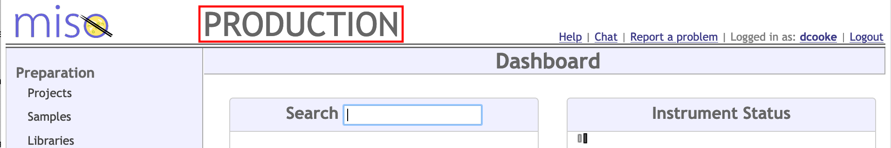

# Site Configuration

This page details all of the options that can be configured in the `miso.properties` file. When setting up MISO, you
should go through this file in detail, ensuring that the settings all make sense for your site. Options marked with a \*
are required. Others may be omitted, or commented out by placing a `#` at the start of the line.

## Storage directories

### `miso.baseDirectory`\*

Base directory for MISO to store things in. Logs, and possibly other items will be created here by MISO. This is also
where MISO will look for the additional `security.properties` and `submission.properties` configuration files. An
absolute path should be specified.

### `miso.fileStorageDirectory`\*

Directory for storing any files uploaded to MISO. An absolute path should be specified.

### `miso.submissionStorageDirectory`\*

Directory for writing ENA submission files to. An absolute path should be specified.

## General settings

### `miso.instanceName`

A name to display in the header of every page. This is especially useful if you have multiple MISO instances, such as
staging and production. Example below.

### `miso.timeCorrection.uiZone`\*

Time zone for the user interface. Times will be displayed in this time zone, and input will be taken in this time zone.
A full timezone name should be specified. e.g. `Canada/Eastern`. See 'TZ database name' column here:
https://en.wikipedia.org/wiki/List_of_tz_database_time_zones

### `miso.fiscalYearStartMonth`

Month (1-12) of fiscal year beginning. If specified, advanced search by fiscal year and quarter will be enabled.

### `miso.bugUrl`

URL for users to report problems. If set, a "Report a problem" link will be added to the header of every page (see above
image). The link will also appear on error pages. This could be used to link to

* Your internal issue tracker
* An email address if provided in the form `mailto:address@domain.com`

### `miso.newOptionSopUrl`

URL of your SOP for adding new options such as scientific names, kits, and indices to MISO. If specified, a message and
link will be shown at the top of several list pages under the Misc and Configuration menus.

### `miso.detailed.sample.enabled`\*

Set `true` to use detailed sample mode, or `false` for plain sample mode. Changing this setting after you have created
any samples is not supported as the data is not compatible between modes. Changing between plain and detailed sample
mode requires starting over with a fresh database.

See the User Manual for more information about detailed sample mode:

* [Detailed Sample Mode](http://localhost:8000/user_manual/site_configuration/#detailed-sample-mode)
* [Sample Classes and Categories](http://localhost:8000/user_manual/type_data/#sample-classes-and-categories)

### `miso.autoGenerateIdentificationBarcodes`\*

Set `false` if your items already have barcodes assigned by some other system. Set `true` to have MISO generate and
assign barcodes for items you create.

## Issue tracker

### `miso.issuetracker.tracker`

If an issue tracker is configured, issues related to projects and runs will be displayed in MISO. The only valid setting
is `jira`, though support for other issue trackers may be added in the future. If specified, the
`miso.issuetracker.jira.baseUrl` and either the JIRA OAuth or HTTP Basic authentication properties (see below) must also
be set.

### `miso.issuetracker.jira.baseUrl`

URL for JIRA.

### `miso.issuetracker.jira.oAuthConsumerKey`

Consumer key to use for OAuth authentication to JIRA.

### `miso.issuetracker.jira.oAuthConsumerSecret`

Consumer secret to use for OAuth authentication to JIRA.

### `miso.issuetracker.jira.oAuthSignatureMethod`

Signature method to use for OAuth authentication to JIRA.

### `miso.issuetracker.jira.httpBasicAuthUsername`

Username to use for HTTP basic authentication to JIRA.

### `miso.issuetracker.jira.httpBasicAuthPassword`

Password to use for HTTP basic authentication to JIRA.

## Email Notifications

These settings are used for sending transfer notifications and may be used for other notifications in the future.

### `miso.smtp.host`

FQDN of SMTP server to send mail through. If host is unspecified, notifications will not be available.

### `miso.smtp.port`

Port to use for sending email via SMTP. Defaults to 25 if not specified.

### `miso.smtp.ssl`

Whether or not to use SSL for SMTP (true/false). Defaults to false if unspecified.

### `miso.smtp.username`

Username for SMTP authentication. Authentication will not be performed if unspecified.

### `miso.smtp.password`

Password for SMTP authentication. Authentication will not be performed if unspecified.

### `miso.smtp.fromAddress`

Email address to display for sender of outgoing mail.

### `miso.smtp.fromName`

Name to display for sender of outgoing mail. Defaults to "MISO" if unspecified.

### `miso.smtp.holdMinutes`

Minimum number of minutes to wait before sending notifications. This allows time for the user to catch mistakes and
revise the data or cancel the notification before it is sent. Defaults to 60 if unspecified.

### `miso.smtp.throttleMinutes`

Defines the time window for throttling outgoing email. Defaults to 60 (minutes) if unspecified.

### `miso.smtp.throttleLimit`

Number of emails that can be sent within the throttle window. Defaults to 25 if unspecified.

### `miso.smtp.internalDomain`

Emails to this domain, if specified, will be considered internal. Internal emails will contain links to MISO entries.

### `miso.internalBaseUrl`

MISO base URL (e.g. "https://miso.example.org"), used for generating links in emails to internal recipients. If
unspecified, emails will not contain links to MISO entries.

## Naming Schemes

MISO Naming Schemes are used to validate and generate entity String fields. They are used for all `name` fields, some
`alias` fields, and project codes.

### `miso.naming.scheme`\*

May be `default`, `oicr`, or `v2`, which have the default configurations shown below. The naming scheme can optionally
be customized further using the other `miso.naming...` properties as detailed below. Only the `default` scheme supports
plain sample mode. For detailed sample mode, `v2` is recommended.

|                             | default                      | oicr                          | v2                   |
|-----------------------------|------------------------------|-------------------------------|----------------------|
| Name Generator              | DefaultNameGenerator         | DefaultNameGenerator          | DefaultNameGenerator |
| Name Validator              | DefaultNameValidator         | DefaultNameValidator          | DefaultNameValidator |
| Sample Alias Generator      | none                         | OicrSampleAliasGenerator      | V2SampleAliasGenerator |
| Sample Alias Validator      | DefaultSampleAliasValidator  | OicrSampleAliasValidator      | V2SampleAliasValidator |
| Library Alias Generator     | DefaultLibraryAliasGenerator | OicrLibraryAliasGenerator     | V2LibraryAliasGenerator |
| Library Alias Validator     | DefaultLibraryAliasValidator | OicrLibraryAliasValidator     | V2LibraryAliasValidator |
| Library Aliquot Alias Generator | DefaultLibraryAliquotAliasGenerator | OicrLibraryAliquotAliasGenerator | V2LibraryAliquotAliasGenerator |
| Library Aliquot Alias Validator | DefaultLibraryAliquotAliasValidator | OicrLibraryAliasValidator | V2LibraryAliquotAliasValidator |
| Project Code Validator | AllowAnythingValidator       | OicrProjectCodeValidator | OicrProjectCodeValidator |
| Configurable components     | all                          | none                          | none |

### `miso.naming.generator.nameable.name`

Change the generator for all entity `name`s.

| Option    | Example     |
|-----------|-------------|
| default   | SAM1        |
| classname | SampleImpl1 |

### `miso.naming.generator.sample.alias`

Change the generator for sample aliases.

| Option  | Example               | Note                             |
|---------|-----------------------|----------------------------------|
| oicr    | PROJ_0001_Ad_P_nn_1-1 | for use with DetailedSample only |
| v2      | PROJ_0001_02_SG03_04  | for use with DetailedSample only |

### `miso.naming.generator.library.alias`

Change the generator for library aliases.

| Option  | Example                  | Note                                                                                                     |
|---------|--------------------------|----------------------------------------------------------------------------------------------------------|
| default | XX_LYY-1                 | XX and YY taken from sample alias - depends on sample alias passing default validator with default regex |
| oicr    | PROJ_0001_Ad_P_PE_300_WG | For use with DetailedSample only. Depends on sample alias passing oicr validator                         |
| v2      | PROJ_0001_02_LB05        | For use with DetailedSample only. Depends on tissue alias passing v2 validator                           |

### `miso.naming.generator.libraryaliquot.alias`

Change the generator for library aliquot aliases.

| Option  | Example                  | Note                                                                             |
|---------|--------------------------|----------------------------------------------------------------------------------|
| default | XX_LYY-1                 | This generator just copies the library's alias                                   |
| oicr    | PROJ_0001_Ad_P_PE_300_WG | For use with DetailedSample only. Depends on sample alias passing oicr validator |
| v2      | PROJ_0001_02_LB05-06     | For use with DetailedSample only. Depends on library alias passing v2 validator  |

### `miso.naming.validator.nameable.name`

Change the validator for all entity `name`s.

| Option   | Detail                                       | Allow null | Allow duplicates | Custom Regex | Custom Duplication |
|----------|----------------------------------------------|------------|------------------|--------------|--------------------|
| default  | Matches 'default' generator, or custom regex | no         | no               | yes          | yes                |
| allowany | Only checks that the name is not null        | no         | yes              | no           | no                 |

### `miso.naming.validator.sample.alias`

Change the validator for sample aliases.

| Option   | Detail                                         | Allow null | Allow duplicates | Custom Regex | Custom Duplication |
|----------|------------------------------------------------|------------|------------------|--------------|--------------------|
| default  | Default regex: `([A-z0-9]+)_S([A-z0-9]+)_(.*)` | no         | no               | yes          | no                 |
| allowany | Only checks that the alias is not null         | no         | yes              | no           | no                 |
| oicr     | Matches 'oicr' generator                       | no         | no               | no           | no                 |
| v2       | Matches 'v2' generator                         | no         | no               | no           | no                 |

### `miso.naming.validator.library.alias`

Change the validator for library aliases.

| Option   | Detail                                 | Allow null | Allow duplicates | Custom Regex | Custom Duplication |
|----------|----------------------------------------|------------|------------------|--------------|--------------------|
| default  | Matches 'default' generator            | no         | no               | yes          | no                 |
| allowany | Only checks that the alias is not null | no         | yes              | no           | no                 |
| oicr     | Matches 'oicr' generator               | no         | no               | no           | no                 |
| v2       | Matches 'v2' generator                 | no         | no               | no           | no                 |

### `miso.naming.validator.libraryaliquot.alias`

Change the validator for library aliquot aliases.

| Option   | Detail                                 | Allow null | Allow duplicates | Custom Regex | Custom Duplication |
|----------|----------------------------------------|------------|------------------|--------------|--------------------|
| default  | Matches 'default' generator            | no         | yes              | yes          | yes                |
| allowany | Only checks that the alias is not null | no         | yes              | no           | no                 |
| oicr     | Matches 'oicr' generator               | no         | no               | no           | no                 |
| v2       | Matches 'v2' generator                 | no         | no               | no           | no                 |

### `miso.naming.validator.project.code`

Change the validator for project codes.

| Option   | Detail                                 | Allow null | Allow duplicates | Custom Regex | Custom Duplication |
|----------|----------------------------------------|------------|------------------|--------------|--------------------|
| allowany | Optional field, no format specified    | yes        | yes              | no           | no                 |
| oicr     | 3-5 characters, CAPS and numbers only  | no         | no               | no           | no                 |

### Custom regex

If a validator accepts custom regex, it can be configured via `<base property>.regex`. e.g.
`miso.naming.validator.nameable.name.regex:.*` to allow any name. A custom validator must be specified for this property
to be enabled - the naming scheme’s default validator will not be altered.

### Custom duplication

If a validator accepts custom duplication, that can be configured via `<base property>.duplicates`. e.g.
`miso.naming.validator.library.alias.duplicates:true` to allow duplicate library aliases. A custom validator must be
specified for this property to be enabled - the naming scheme’s default validator will not be altered.

### Secondary Naming Scheme

It is possible to configure a second naming scheme using the same properties above, except replacing `naming` with `naming2`,
e.g. `miso.naming2.scheme=v2`. When two naming schemes are configured, an extra field called "Use Secondary Naming Scheme"
is shown on the Edit Project page. If unselected, the primary naming scheme will be used for the project; if selected, the
secondary scheme is used instead. The secondary scheme will only ever be used for items that are tied to a single project. This
includes samples, libraries, and library aliquots. Other items, such as pools, boxes, and studies will always use the primary
naming scheme. When using two naming schemes, it is ideal to use the same name generator (`nameable.name`) in both in order
to maintain consistent names throughout MISO.

If you are switching to a new naming scheme and want it to be the default for new projects, you can make your current naming
scheme secondary and the new one primary. Set all existing projects to use the secondary naming scheme, and they will continue
to use the old scheme. This way, you don't have to select "Use Secondary Naming Scheme" for every new project.

## Integration

### `miso.taxonLookup.enabled`

Defaults to `false` if unspecified. If set to `true`, the NCBI taxon lookup service will be used to validate scientific
names.

### `miso.runscanner.urls`

URLs of Run Scanners to use for populating and updating runs. Multiple Run Scanners can be specified separated by using
a space to separate.
### `miso.runscanner.interval`

Interval in milliseconds to poll Run Scanner(s). Defaults to `300000` (5 minutes) if unspecified;

### `miso.boxscanner.servers`

Config for Visionmate or DP5Mirage bulk barcode scanners. Enter in format 
`<name>:<type>:<host/IP address>:<port>`. Multiple scanners may be specified by using a comma to 
separate. Valid types include: `visionmate` and `dp5mirage`.

For the DP5Mirage bulk barcode scanner, you must create a container on the DP5 software 
application with the expected Container ID name set to 'mirage96sbs'.

Example: `Lab 1 Scanner:visionmate:192.168.0.120:8000,Lab 2 Scanner:dp5mirage:scanner.example.com:8000`

### `miso.project.report.links`

Config for links to external project report services to display on Edit Project page. Enter in format
`<link text>|<URI with placeholders>`. Placeholders can be any of `{id}`, `{name}`, `{code}`. Multiple reports can
be specified by using a double backslash to separate.

Example: `miso.project.report.links: External Project Link|http://example.com/{id}\\Another Project Link|http://example.com/project/{name}`

For a project with ID 123 and name "PRO123," this will create an "External Project Link" link to
`http://example.com/123` and an "Another Project Link" link to `http://example.com/project/PRO123`.

### `miso.run.report.links`

Config for links to external run report services to display on Edit Run page. Enter in format
`<PlatformTypes>|<link text>|<URI with placeholders>`. Multiple platform types can be specified by separating with
commas. Placeholders can be any of `{id}`, `{name}`, `{alias}`. Multiple reports can be specified by using a double
backslash to separate.

Example: `miso.run.report.links: Illumina,PacBio|Generic Run Report|http://example.com/{id}\\Illumina|Illumina Run Report|http://example.com/illumina/{alias}`

For an Illumina run with ID 456 and alias "200723_D00789_0123_BCEHPCANXX," this will create a "Generic Run Report" link
to `http://example.com/456` and an "Illumina Run Report" link to
`http://example.com/illumina/200723_D00789_0123_BCEHPCANXX`.

A PacBio run will only have the "Generic Run Report" link.

## Bulk Table Customization

### `miso.defaults.sample.bulk.scientificname`
Default scientific name to use when creating samples. Note that projects specify a reference genome and reference
genomes may specify a default scientific name, which will override this setting.

### `miso.display.library.bulk.libraryalias`

Defaults to `true` if unspecified. Set to `false` to hide the alias column when bulk creating/editing libraries. Only do
this if library aliases are always generated by MISO and you do not want to see them.

### `miso.display.library.bulk.description`

Defaults to `true` if unspecified. Set to `false` to hide the description column when bulk creating/editing libraries.

### `miso.display.library.bulk.volume`

Defaults to `true` if unspecified. Set to `false` to hide the volume column when bulk creating/editing libraries.

## Index Checking

### `miso.pools.strictIndexChecking`

Defaults to `false` if unspecified. If set to `true`, library aliquots with duplicate or near-duplicate indices cannot
be added to pools.

### `miso.pools.error.index.mismatches`

Maximum number of mismatches to consider a duplicate index error. Defaults to `1` if unspecified.

### `miso.pools.error.index.mismatches.message`

Error label to display for duplicate indices. Defaults to "DUPLICATE INDICES" if unspecified.

### `miso.pools.warning.index.mismatches`

Maximum number of mismatches to consider a near-duplicate index warning. Defaults to `2` if unspecified.

### `miso.pools.warning.index.mismatches.message`

Warning label to display for near-duplicate indices. Defaults to "Near-Duplicate Indices" if unspecified.
