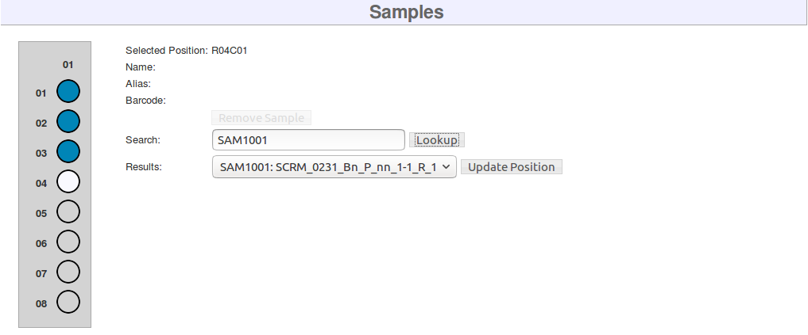

# Arrays

## Arrays List

To get to the Arrays list page, click "Arrays" in the Array Scanning list in the menu on the left side of the screen.
This list includes all arrays from all projects in MISO. The toolbar at the top of the table includes controls for
working with arrays.

## Creating an Array

Clicking the "Add" button in the toolbar at the top of the Arrays list will take you to the Create Array page. Here,
you can enter all of the array information and then click the "Save" button at the top right to save the array. After
saving, you will be taken to the single Edit Array page, where you can add samples and further modify the array.

## Editing an Array

To get to the single Edit Array page, click on the array's ID, alias, or serial number in the Arrays list. The top
section of the Edit Array page contains a list of fields, most of which may be modified. You can make any changes you
would like and then click the "Save" button at the top right to confirm the changes. The Samples section below that
allows you to add and remove samples from the array, which is discussed below. Under that, there are sections listing
the array runs that the array has been used in, and the array's change log.

## Adding a Sample to an Array

Samples can be added to an array using the Edit Array page. In the Samples section, there is a diagram of the array
contents (see figure below). Blue circles in the diagram represent positions where samples have already been
added. Grey circles are empty positions. Select a position by clicking on its circle in the diagram.

*Array contents diagram*

Once a position is selected, the search controls become available. Enter the name, alias, or barcode of a sample into
the search box and click the Lookup button to perform the search. If your site uses
[detailed sample mode](../site_configuration/#detailed-sample-mode), only aliquot samples will be searched. The search
results will appear in the Results dropdown. Ensure that the correct sample is selected and then click the Update
Position button to add the sample to the array position.

## Removing a Sample from an Array

Removing samples from the array can also be done on the Edit Array page. Select an array position containing a sample,
as described above, and then click the Remove Sample button to do so.

## Deleting Arrays

To delete arrays, go to the Arrays list page, select the arrays that you wish to delete, and click the "Delete" button
in the toolbar at the top of the table. An array can only be deleted by its creator or a MISO administrator, and only
if is not attached to any array runs.
