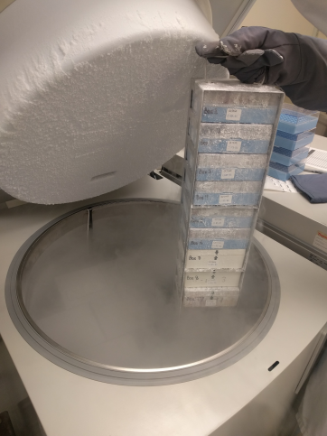

# Freezers and Rooms

Freezers and rooms describe physical storage locations to help you locate things in the real world. In MISO, samples,
libraries, library aliquots and pools can be stored in boxes. Those boxes can be stored in freezers, and the freezers
are located in rooms.

Location maps can be uploaded, and then links can be made from freezers to these maps to show where they are located.
Maps may be in any format with likely choices including html, pdf, and image files. If html maps are used, a freezer
may also specify an anchor link to further help with locating the freezer on the map page.

## Location Maps

To get to the Location Maps list, click "Location Maps" in the Misc list in the navigation menu. You can open a map by
clicking its filename in the list. MISO administrators can upload new maps and delete existing maps from here too.

To upload a new map, click the "Upload" button in the toolbar at the top of the table. In the dialog that appears,
select the file to upload and optionally enter a description. Click the "Upload" button to finish.

To delete a map, select it in the list and click the "Delete" button in the toolbar at the top of the table. Click
"Delete" again in the dialog to confirm. A location map can only be deleted if there are no freezers linking to it.

## Storage Locations List

To get to the Storage Locations list, click "Freezers & Rooms" in the Misc list in the menu on the left side of the
screen. The page is divided into two tabs -- one for freezers, and one for rooms. The toolbar at the top of the list
includes controls for working with freezers or rooms, depending on which tab is selected.

## Adding a Room

To add a room, go to the Storage Locations list, ensure that the Rooms tab is selected, and click the "Add" button in
the toolbar at the top of the list. A dialog will appear where you can enter the alias and optionally a barcode for the
room. Click the "Add" button to save the new room.

## Adding a Freezer

To add a freezer, go to the Storage Locations list, ensure that the Freezers tab is selected, and click the "Add"
button in the toolbar at the top of the list. This will take you to the Create Freezer page where you can enter all of
the freezer details. If you have uploaded a location map that shows the freezer's location, you can select it, and
optionally enter an anchor tag, to create a link. If the freezer is connected to a monitoring system, you can include
its ID from that system in the probe ID field. When you are done, click the "Save" button at the top right. After
saving, you will be taken to the Edit Freezer page, where you can add storage units such as shelving and racks, and
further modify the freezer.

## Editing a Freezer

To get to the Edit Freezer page, click the freezer name in the Freezer's tab of the Storage Locations list. In the top
section of the page, you can edit the same details as on the Create Freezer page. Make any changes you would like, then
click the "Save" button at the top right to confirm. The Layout section allows you to define the layout of the freezer,
which is described below. A change log for the freezer is included at the bottom of the page.

## Adding Storage to a Freezer

The Layout section of the Edit Freezer page allows you to add storage spaces to define the layout of the inside of the
freezer. There are several types of storage to accomodate different layouts that a freezer might have. Each of these
are detailed below.

### Shelves

Shelves are horizontal dividers within a freezer that other storage units can sit on. They are added directly to a
freezer.

To add a shelf, click the "Add Storage" button beside the "Freezer" label in the Layout section. In the Add
Freezer Storage dialog that appears, select "Shelf." Enter a barcode for the shelf if you would like, and then click
the "OK" button. The shelf will appear in the Layout diagram.

You can click an existing shelf in the diagram to select it, which allows you to change the barcode. Another "Add
Storage" button appears on the shelf in the diagram to add further storage units within the shelf.

### Stacks

A stack is a shelving unit that holds a vertical stack of boxes. It can have any number of slots, each of which can
hold a box. Slots within a stack are numbered from the bottom up. Stacks can be added to shelves, or directly to
freezers.

*A stack*

To add a stack, click the "Add Storage" button either beside the "Freezer" label to add it directly to the freezer, or
beside a shelf label to add it to a shelf. In the dialog that appears, choose "Stack." In the next dialog, choose
height of the stack -- the number of boxes that it holds -- and optionally enter a barcode, then click the "OK" button.
The final dialog allows you to enter a barcode for each of the individual slots in the stack. Do so if you wish, then
click the "OK" button again to finish creating the stack. The stack will appear in the Layout diagram within the
freezer or shelf to which you added it.

You can click an existing stack in the diagram to select it, which allows you to change its barcode. Once you've
selected a stack, a second diagram appears showing the slots within the stack. You can click on a slot in this diagram
to select the slot, allowing you to change its barcode, or add a box to it.

### Racks

A rack is a shelving unit that holds several stacks of boxes. It can have any number of columns (stacks) and rows
(slots). Each slot in each stack can hold a box. Stacks within a rack are numbered from front to back, and slots within
a stack are numbered from bottom to top. Racks can only be added to shelves.

*A rack*

To add a rack, click the "Add Storage" button beside the shelf label of the shelf to which you wish to add it. In the
Add Shelf Storage dialog, choose "Rack." In the next dialog, choose the number of stacks and rows and optionally a
barcode for the rack, then click the "OK" button. A final dialog allows you to enter a barcode for each individual slot
if you wish. Click the "OK" button to finish adding the rack. It will appear in the Layout diagram within the shelf.

You can click an existing rack in the diagram to select it, which allows you to change its barcode. Once you've
selected a rack, a second diagram appears showing the slots within the rack. You can click a slot in this diagram to
select the slot, allowing you to change its barcode or add a box to it.

### Tray Racks

A tray rack is a stack of drawers or trays. Each tray can hold any number of boxes, and there is no specific
organization of the boxes within the tray. Trays within a tray rack are numbered from the top down. Tray racks can only
be added to shelves.

To add a tray rack, click the "Add Storage" button beside the shelf label of the shelf to which you would like to add
it. In the Add Shelf Storage dialog, choose "Tray Rack." In the next dialog, choose the number of trays (rows) and
optionally a barcode for the tray rack, then click the "OK" button. A final dialog allows you to enter a barcode for
each tray within the tray rack if you wish. Click the "OK" button when you are done to finish adding the tray rack. It
will appear in the Layout diagram within the shelf.

You can click an existing tray rack in the diagram to select it, which allows you to change its barcode. Once you've
selected a tray rack, a second diagram appears showing the trays within the tray rack. You can click a tray in this
diagram to select the tray, allowing you to change its barcode or add boxes to it.

### Loose Storage

Loose storage defines all or part of a shelf that has boxes stored directly on it with no further organization. Any
number of boxes can be stored within a loose storage space. Loose storage can only be added to shelves.

To add loose storage, click the "Add Storage" button next to the shelf label in the Layout diagram. In the Add Shelf
Storage dialog that appears, choose "Loose Storage." The loose storage unit will appear in the Layout diagram within
the shelf that you added it to.

You can click an existing loose storage unit in the diagram to select it. Once you have done so, a second diagram
appears showing any boxes contained in the space. Clicking this diagram will bring up a dialog that allows you to add
a box to the space or view any of the boxes that have already been added.

## Deleting Storage from a Freezer

To delete a storage component such as a shelf or rack from a freezer, select the component in the layout diagram and
click the "Delete" button that appears in the Edit section for the component. A component can only be deleted if it
contains no boxes.

## Adding Boxes to Storage

To add a box to storage, first select a storage unit in the Layout diagram that can hold a box. This includes positions
within stacks and racks, trays within tray racks, and loose storage units. When you select the storage unit, a dialog
appears. In the dialog, enter the name or alias of the box you wish to add and click the "Search" button. A list of
matching boxes will be shown. Select the box you wish to add. It will be added into the storage unit you had selected.
If there was already another box stored in the storage unit you had selected, it will be replaced.

## Deleting Freezers and Rooms

Freezers and rooms can be deleted from the Storage Locations list page. Select the items that you wish to delete, then
click the "Delete" button in the toolbar at the top of the list. Freezers and rooms can only be deleted by MISO
administrators or their creators. A room can only be deleted if it contains no freezers. A freezer can only be deleted
if it contains no boxes.
