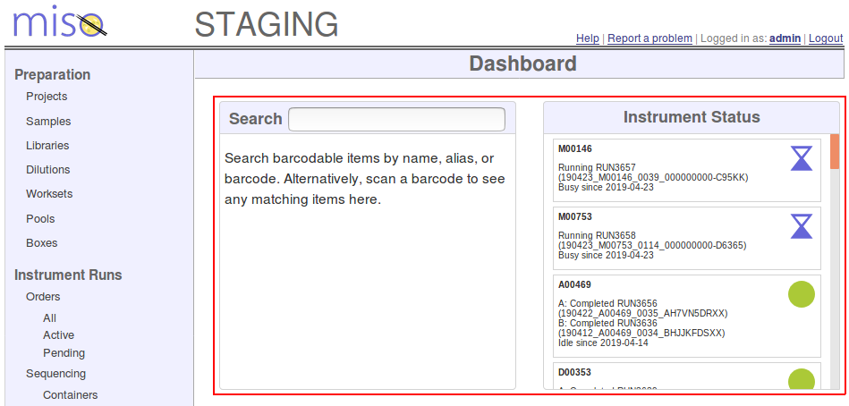
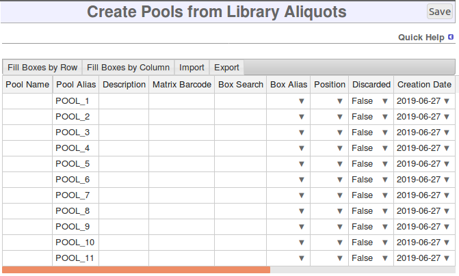

# General Navigation

## Home Screen
The Home Screen or Home Page is the main page of MISO, and contains [widgets](#home-screen-widgets) and links
to other areas of MISO. To get to the Home Screen, click on either the MISO logo in the top left corner of all MISO
pages.

## Home Screen Widgets

*Home screen widgets*

You'll find a number of widgets on the home screen. How you interact with these varies
depending on the individual widget. Some have a search box that can be used to filter what is displayed. Clicking
on a tile within a widget will either take you to the single-item edit page for the item, open a menu with options
depending on the item you clicked, or perform some other action.

Individual widgets are described in more detail in the [Home Screen Widgets section](../home_screen_widgets/)

## List Pages

You can access the list pages by clicking links in the menu on the left side of the screen. For example, to access the
Samples list, click "Samples" in the Preparation list. These list pages all have similar features and behaviours, as
described below.

A dropdown at the top of the table allows you to choose how many entries are shown on a single page. Controls at the
bottom of the page can be used to move to other pages.

### Selecting Items

Tables which allow you to select items will have a column of checkboxes on the left-hand side. To select an item,
check the checkbox in the row of the item you wish to select. To deselect an item, uncheck the checkbox. Multiple items
may be selected by checking multiple checkboxes.

You can select a range of checkboxes by checking the first item you'd like to select, then holding the shift key while
you check the last item that you'd like to select. For example, if you check the checkbox in row 3, then hold shift and
check the checkbox in row 6, this will result in rows 3, 4, 5, and 6 being selected.

The toolbar at the top of the table also contains controls to select (☑) and deselect (☐) all items. The select all
button will only select the items on the current page, whereas the deselect all button will deselect all items on all
pages.

### Selecting by Search

Several of the list pages have a "Select by names" feature which is represented by a button in the toolbar that looks
like a clipboard (📋). Clicking this button will open a dialog which prompts you to enter names, aliases, or barcodes.
This allows you to search for multiple items at once, using any of those attributes. Enter the names, aliases, or
barcodes, one per line, then click the "Search" button. You will be given the option of what to do with the selected
items. These will be the same options as are available in the list page's toolbar, with two additions:

* **View Selected**: shows the name and alias of each selected item. You can click "OK" after viewing the list to
  return to the options menu with the samples still selected
* **Select in list**: closes the dialog, but selects the items in the list so that you can continue to work with them

This feature is useful if you have a list of names, aliases, or barcodes that you can copy from a spreadsheet, or if
you have several barcoded items that you can scan into the dialog.

### Searching

Each of the list pages has a search box at the top right of the table. You can enter your search terms and press Enter
to filter the data that is shown in the table.

*Advanced search*

Some tables have "Advanced Search," which allows you to better describe what it is that you're looking for. You can
tell which tables have Advanced Search because they will have a black help bubble (?) beside them. 
You can click this bubble to see a full list of the applicable search terms for this page. For example, on
the Samples list page, you can search for samples by the box that they're stored in (`box:boxname`) or the date they
were created (`created:today`).

On pages that don't have Advanced Search, the search is only looking at the text you can see in the table, and
sometimes some additional hidden fields. There is no way to specify which columns to search.

MISO remembers your recent searches, and will maintain the search results on a list page for some time. Clear the
search box and press Enter to reset the page and show all items again.

### Sorting

Some list pages allow you to change the sorting order. You can tell which columns are sortable because they have up
and/or down arrows in the column heading. Click on the column heading to sort the table by that column. Click the same
column heading again to reverse the sorting order.

### Finding Related Items

Several tables (Samples, Libraries, Library Aliquots, and Pools) have toolbar buttons labelled "Parents" and
"Children." These allow you to find items related to the ones you have selected. For instance, you can select a number
of library aliquots on the Library Aliquots list page, click "Parents," and choose "Library" from the dialog. This will
select all of the Libraries from which the selected library aliquots were propagated. You can then select an action to
perform on the libraries. This will be the same set of options that are available on the Libraries list page. One item
is said to be the "parent" of another if the other item was created using the first. A library is the parent of a
library aliquot because the aliquot was made from the library.

Here is a list of all the related item types that can be selected using the "Parents" and "Children" buttons where
lower-numbered items are parents of the higher-numbered items:

1. Samples
1. Libraries
1. Library Aliquots
1. Pools

If your site uses detailed sample mode, samples are broken into several additional types:

1. Identity Samples
1. Tissue Samples
1. Tissue Processing Samples
1. Stock Samples
1. Aliquot Samples

## Single Item Create/Edit Pages

Many types of items within MISO have an edit page that allows you to modify a single item. In some cases, the same page
is also used to create new items.

These single-item create/edit pages mainly consist of a form listing all of the item's attributes. Attributes marked
with an asterisk (\*) are required and must be filled in before the item can be saved. Upon attempting to save, any
fields that are invalid will be marked in red, and an error message will appear to explain the problem.

*Single item create/edit page*

Depending on the item type, there will usually be a number of tables below the item's attributes. These tables will
detail items related to the one you're working with. These tables function similarly to the list pages, allowing you to
work with the related items. 

## Collapsible Sections

Some of the single item edit pages can get quite long if there is a lot of related information. To help shorten the
pages, some sections may be collapsed. To expand these, click anywhere within the heading line of the collapsed
section. Click on the heading line again to collapse the section once more. The figure below shows some collapsed
sections.

*Collapsed page sections*

## Change Logs

Many of the single item edit pages include a Changes table at the very bottom. This is a log of changes that have been
made to an item and serves as a record of the item's history. It shows when each change was made, who made the change,
and what exactly was changed. If the item's attributes were affected, the change log entry shows which attributes were
changed and includes the value both before and after the change. Sometimes a change does not affect the item's
attributes, but is still important to the item's history. These actions are also logged, and include thing such as
adding a sequencing container to a run, and removing an item from a box.

## Notes

Most items in MISO have a description field, which allows you to enter any text that you would like. For cases where
you'd like to provide more detail, a Notes section appears on several of the single item edit pages. This allows you to
record any number of details about the item. For more information on working with Notes, see the
[Notes section](../notes/).

## Bulk Create/Edit Pages

In addition to creating and editing single items, it is often useful to work with many items at once. MISO provides
many bulk create/edit pages to facilitate this (see figure {{figure}}). These bulk pages feature a spreadsheet-like
interface with features similar to popular spreadsheet software.

*Bulk propagate library aliquots page*

Any cells that are invalid will be highlighted in red. This includes any required cells which are left blank. Upon
saving the table, it is possible that some items save successfully while others fail for various reasons. Any row
that has been successfully saved will be disabled, and can no longer be modified. Error messages will be displayed
at the top of the table to indicate why any item failed to save. You are then able to make any necessary changes to the
remaining items before attempting to save again.

After successfully saving all rows, the table toolbar will include the same
options as the tool bar of the appropriate list page. This allows continuing
work with the same items by moving through propagation steps for the same
items.

### Autofill

In any of the bulk tables, you can autofill a column by setting a value in the top row, selecting that cell, and then
either dragging the fill handle to include all of the cells that you would like to copy the value to, or simply
double-clicking the fill handle to autofill to the bottom of the column. The fill handle is the little square at the
bottom right of the selected cell(s).

If you wish to increment a number within the column, you can do that by entering the first two cell values, selecting
both of those cells, and then using the fill handle in the same manner. For example, if you wished to set Pool aliases
similar to those in figure {{figure}}, you could enter "POOL_01" into the first row, "POOL_02" into the second row,
select both of these cells, then double-click the fill handle to continue the pattern to the bottom of the table.

## Exporting to Spreadsheet

All of the bulk pages include an Export button in the toolbar. This allows you to download a spreadsheet containing all
of the data in the table. A dialog will give you the option of which format to output the spreadsheet in. Microsoft
Excel (\*.xlsx), Open Document Format (\*.odt), and comma-delimited data (\*.csv) formats are supported.

## Tools

The Tools list in the menu on the left-hand side of the page contains links to tools that are helpful for finding and
working with items in MISO and the lab. Individual tools are documented in more detail in the
[Other MISO Tools section](../other_miso_tools/).

## My Account

Clicking on your username near the top right of the screen will take you to a page showing your name and the groups
that you belong to. There is an Edit link that will open a page showing more of your user details. Depending on your
site configuration, you may be able to edit some of these details and reset your password from this page. See
[Authentication](../site_configuration/#logging_in) for more details.

If you are a MISO administrator, an Administration section will also appear on the My Account page. The Clear Cache
action should not be necessary, but can be used to help troubleshoot bugs. The Refresh Constants action can be used to
make new type data values show up immediately in cases where they do not. For more information, see the
[Type Data section](../type_data/).

## Help

The "Help" link near the top right of the screen will link you to this user manual.

## Quick Help

*Quick Help*

Many pages in MISO include a Quick Help section. This section is hidden by default, but can be shown by clicking the
"Quick Help" heading near the top of the screen. The Quick Help section displays tips and
details to help you work with the page.

