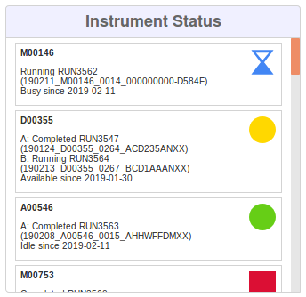

# Home Screen Widgets

## Search

The Search widget can be used to quickly find an item in MISO. This includes samples, libraries, library aliquots,
pools, sequencing containers, and boxes. Note that there are separate search widgets for projects and runs, detailed
below. You can search for an item by its name, alias, or barcode. Scanning an item's barcode using a barcode scanner
also works. The search returns exact matches only, so you must enter the entire name, alias, or barcode to find what
you are looking for. Press the Enter key to run the search. The search results will appear in the widget and you can
click on a result tile to go to the Edit page for that item.

## Instrument Status

*Instrument Status Widget*

The Instrument Status widget provides a view of what your sequencers are doing. All sequencers are listed along with
their current status and their most recent runs. The most recent status changes appear at the top of the list.
Sequencers that can perform multiple simultaneous runs will show the status of each position. Status can be one of the
following.

* **Idle**: The sequencer is not currently in use
* **Available**: One or more of the sequencer's positions are either active or out of service, but one or more
  positions are still idle
* **Busy**: All of the sequencer's positions are active
* **Out of Service**: All of the sequencer's positions are out of service

Clicking on a tile in the Instrument Status widget will open a menu where you can choose to view the instrument, one of
the latest runs, or one of the pools from one of the latest runs. Click an option in this menu to go to the Edit page
for the selected item.

## Workflows

The Workflows widget is used to start new workflows and resume existing workflows. It also allows you to mark favourite
workflows for convenience. Usage of the Workflows widget is detailed in the [Workflows section](../workflows/).

## Project

The Project widget allows you to quickly search for a project by its name, alias, short name, or description. This
search will find partial matches, so you don't have to enter the entire name, alias, or description. Enter your query
and press the Enter key to run the search. Search results will appear in the widget. You can click a result tile to go
to the Edit Project page.

## Run

The Run widget initially shows all of the most recent runs. You can click a run tile in the widget to get to the Edit
Run page. You can also use the widget to search for a run by its name, alias, or description. This search will find
partial matches, so you don't have to enter the entire name, alias, or description. Search results will appear in the
widget and you can click a result tile to go to the Edit Run page.

