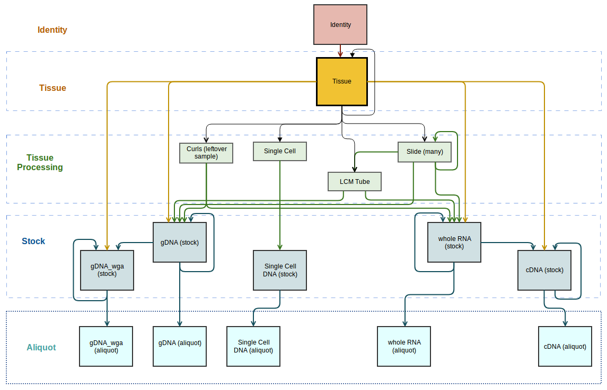

# Type Data

Type data describes sets of items listed as dropdown options in various forms throughout MISO. Most of these options
can be modified to suit your institute. In most cases, only MISO administrators can make these changes.

Each type that can be modified within MISO has a list page. You can find most of these by clicking to expand the
Configuration menu within the main navigation menu, and then clicking the appropriate link within. Any that is
located elsewhere will be noted in its description below.

To add new items, click the “Add” button in the toolbar at the top of the list. In the dialog, enter the quantity that
you would like to create, and click the “Create” button. This will take you to the bulk Create page. Enter the
information for the new items, and click the “Save” button at the top right to confirm.

To edit existing items, go to the list page, check the checkboxes beside the items you would like to edit, and click
the “Edit” button in the toolbar at the top of the table. This will bring you to the bulk Edit page, which is identical
to the bulk Create page mentioned above. Here, you can modify the existing items. Be sure to click the "Save" button at
the top right to confirm any changes. Keep in mind that any changes you make will affect all existing items that are
already using the affected options. For example, if you rename a kit descriptor, existing libraries that are already
using that kit will be affected.

To delete items, go to the list page, check the checkboxes beside the items you would like to delete, and click the
“Delete” button in the toolbar at the top of the table. You will only be able to delete items that are not in use.

## Pipelines

Each project specifies a pipeline so that you can use this information in downstream analysis to decide how to handle
sequencing run data.

MISO administrators can add, edit, and delete pipelines using the standard interface. A pipeline can only be deleted if
it is not used by any existing projects.

## Scientific Names

Scientific name is the species that a sample came from. These are intended to match the taxon names in the NCBI Taxonomy
Database, and if taxon lookup is enabled for your site (See [Site Configuration](../site_configuration/#taxon-lookup),
this will be enforced.

MISO administrators can add, edit, and delete scientific names using the standard interface. A scientific name can only
be deleted if it is not used by any existing samples, and is not the default scientific name for any reference genomes.

## Reference Genomes

Reference genome refers to a file that sequenced data will be aligned to. This is set at the project level, and can be
changed on both the Create Project and Edit Project page. A reference genome may specify a default scientific name to
be used for new samples within the project.

MISO administrators can add, edit, and delete reference genomes using the standard interface. A reference genome can
only be deleted if it is not used by any existing projects.

## Deliverables

A deliverable is the product that will be transferred to the client. This is set at the project level, and can be 
changed on both the Create Project and Edit Project page.

Only MISO administrators are able to create, edit and delete deliverables using the standard interface. A deliverable
is only deletable if it is not being used by any projects.

## Sample Types

**WARNING**: Sample type is defined by [NCBI](https://www.ncbi.nlm.nih.gov/) and is required in order to submit samples
to the ENA (see the [ENA section](../european_nucleotide_archive_support/)). The values available in MISO should be
limited to the default options, which are the same as defined in the ENA schema. If these values are modified, or
additional options are added, your data may not be valid for ENA submission.

It is possible to archive sample types if they are not used within your organization. An archived sample type will not
show up in the sample type options when creating or editing samples, unless the samples being edited have already used
that sample type. Sample types can always be unarchived if they are needed in the future.

MISO administrators can add, edit, and delete sample types using the standard interface. Sample types can be set as
archived on the bulk Create or Edit page. A sample type can only be deleted if the option has not been used by any
existing samples.

## Sample Classes and Categories

Note: These items only apply if your site uses [detailed sample mode](../site_configuration/#detailed-sample-mode).

Detailed sample mode introduces a hierarchy of samples. Sample classes identify where a sample fits into the hierarchy.
Sample categories are used to group sample classes into levels. Some sample categories contain subcategories, which
define additional fields for sample classes. Sample categories and subcategories may not be modified. See
[Detailed Sample Mode](../site_configuration/#detailed-sample-mode) for more information about the sample categories
and ghost samples.

Sample classes, and the relationships between them define the sample hierarchy. Both the classes and relationships can
be customized to suit your requirements. The figure below shows the sample hierarchy used at OICR. Sample
relationships have a parent and child class. This means that if you have a sample of the parent class, you can
propagate a sample of the child class.

*OICR sample hierarchy. The relationships are illustrated using arrows that point from the parent class to the child class.*

Sample classes may be archived, which means that they will no longer be available when creating new samples. Similarly,
relationships between classes may also be archived. This means that you will no longer be able to propagate samples
to create that type of relationship. Using the OICR sample hierarchy in figure 1 as an example, we could
archive the relationship between Slide and LCM Tube to prevent users from propagating LCM Tubes from Slide samples.

Another option is to prevent direct creation of a sample class. This means that the sample class will be available as
an option for the aliquot class to use when receiving libraries, but it won't be available as an option when creating
or propagating samples. This is useful if you want to have an "Unknown" type of sample class for cases where libraries
are received and not much is known about the samples they were made from.

MISO administrators can create, edit, and delete sample classes using the standard interface. A sample class can only
be deleted if there are no existing samples of that class.

In the top section of the Create/Edit Sample Class page, you can enter or change the sample class attributes. In the
Parent Relationships table below, you can add, edit, and remove relationships that define which classes this one can be
propagated from. Click the "Add" button and choose a sample class to create a new parent relationship. Select a
relationship and click the "Remove" button to remove it. Archive or unarchive existing relationships by selecting the
relationship(s) and clicking the "Un/Archive Relationships" button. A relationship cannot be removed if there are
existing samples using it, but it can be archived instead. Be sure to click the "Save" button at the top right to
confirm any changes. The Create/Edit Sample Class page does not allow you to modify child relationships. To do so, you
must go to the Edit Sample Class page for the child sample class and modify the parent relationship.

A custom hierarchy must follow these rules:

* there may be only one identity class
* with the exception of identity classes, any class may be parented to itself
* any class may be parented to another class in the same category
* an aliquot class must always be parented to a single stock class
* a stock class may be parented to tissue processing classes, but must always be parented to a single tissue class
  * exception: a stock class in the Single Cell (stock) subcategory should be parented to a tissue processing class
    in the Single Cell subcategory instead of a tissue class
* a tissue class must be parented to the identity class
* there must be a path from every sample class to the identity class

To delete sample classes, go to the Sample Classes list page, select the sample class(es) you wish to delete, and click
the "Delete" button in the toolbar. A sample class can only be deleted if no samples have been created using it. If
there are existing samples of the sample class, it can be archived instead.

## Tissue Materials

Note: This item only applies if your site uses [detailed sample mode](../site_configuration/#detailed-sample-mode).

Tissue materials describe how the tissue was prepared and may include options such as 'Fresh Frozen,' 'FFPE,' and 'Blood.'
Tissue material is an optional field for tissue samples.

MISO administrators can add, edit, and delete tissue materials using the standard interface. A tissue material can only be
deleted if the option has not been used by any existing samples.

## Tissue Origins

Note: This item only applies if your site uses [detailed sample mode](../site_configuration/#detailed-sample-mode).

Tissue origins describe what part of the donor or organism the sample was taken from. For human donors, options may
include 'Brain,' 'Lung,' and 'Pancreas.' The alias is a short code that may be used for generating sample aliases
depending on the naming scheme (e.g. "Lv"). The description is the full origin name (e.g. "Liver").

MISO administrators can add, edit, and delete tissue origins using the standard interface. A tissue origin can only be
deleted if the option has not been used by any existing samples.

## Tissue Piece Types

Note: This item only applies if your site uses [detailed sample mode](../site_configuration/#detailed-sample-mode).

For tissue processing, slides can be made and then used for various other
preparations (e.g., LCM). A tissue piece is a sample class that consumes slides
to produce some new thing. The tissue piece type is the type of these new
things. By default, _LCM Tube_ is created for laser-captured microdissection,
but curls, macrodissections, and extracted nuclei are other procedures in this
category.

MISO administrators can add, edit, and delete tissue piece types using the
standard interface. A tissue piece type can only be deleted if the option has
not been used by any existing samples.

## Tissue Types

Note: This item only applies if your site uses [detailed sample mode](../site_configuration/#detailed-sample-mode).

Tissue Type is a classifier for tissue samples. It may be used to categorize the sample. For example, tissue types at
OICR include the following (and others).

* Reference Tissue: Reference or non-tumour, non-diseased tissue sample. Typically used as a donor-specific comparison
  to a diseased tissue, usually a cancer
* Primary Tumor Tissue
* Metastatic Tumor Tissue
* Xenograft Tissue: Xenograft derived from some tumour
* Organoid

MISO administrators can add, edit, and delete tissue types using the standard interface. A tissue type can only be
deleted if the option has not been used by any existing samples.

## Sample Purposes

Note: This item only applies if your site uses [detailed sample mode](../site_configuration/#detailed-sample-mode).

Sample purpose describes the reason an aliquot was created. Example purposes include, 'Library,' 'Validation,' and
'Extra.'

MISO administrators can add, edit, and delete sample purposes using the standard interface. A sample purpose can only
be deleted if the option has not been used by any existing samples.

## Labs

Labs can be recorded as the sender that samples, libraries, library aliquots, or pools were received from. Labs can be
archived, which means they will no longer show up in dropdowns when creating new transfers.

Any user may create new labs in MISO using the standard interface. Administrators may also edit and delete existing
labs. You will only be allowed to delete a lab if it has not been used by any existing receipt transfers. If a lab has
been used for existing receipt transfers and you no longer wish to see the option in dropdowns when creating new
transfers, you can archive the lab instead.

## Detailed QC Status

Detailed QC statuses are the options available for the "QC Status" field on samples, libraries, and library aliquots.
Values specify a status of passed, failed, or unknown, and also provide more specific information about the reason. Here
are some examples:

* "Okd by Collaborator" (QC status: passed) - may indicate that a collaborator has approved use of the sample despite
  other QC checks
* "Waiting: Receive Tissue" (QC status: unknown) - indicates that the tissue has not yet been received, so no QC has
  been performed yet
* "Refused Consent" (QC status: failed) - indicates that while the sample may have passed QC, the donor has revoked
  consent for it to be used

Some detailed QC statuses require a note, which means that when selecting the status, the user must also type in a note
detailing why the option was chosen.

MISO administrators can add, edit, and delete detailed QC statuses using the standard interface. A detailed QC status
can only be deleted if the status has not been used by any existing samples.

## Stains

Note: This item only applies if your site uses [detailed sample mode](../site_configuration/#detailed-sample-mode).

Different stains such as Cresyl Violet and Hematoxylin+Eosin may be used on a slide sample. These stains can be broken
into categories, which is useful if you use many different stains.

MISO administrators can add, edit, and delete both stains and stain categories using the standard interface. A stain
can only be deleted if the option has not been used by any existing samples. A stain category can only be deleted if
there are no stains associated with it.

## Sequencing Control Types

A sample can be marked as a control for sequencing, and you can define the available control types how you like. It
may make sense to have "Positive" and "Negative" control types, or other types may also make sense. In plain sample
mode, any sample can be marked as a control. In detailed sample mode, the option is available for aliquot samples.
This option can only be changed on the single Edit Sample page - it does not appear on the bulk Create/Edit Samples
pages.

MISO administrators can add, edit, and delete sequencing control types using the standard interface. A sequencing
control type can only be deleted if the option has not been used by any existing samples.

## Standard Operating Procedures

Standard operating procedures (SOPs) describe the process that was followed to prepare samples or libraries, or to
perform a sequencing run. An SOP in MISO has a name and version, and links to the actual SOP in another system.

MISO administrators can add, edit, and delete SOPs using the standard interface. An SOP can only be deleted if
it has not been used for any existing samples, libraries, or runs.

When editing SOPs in MISO, keep in mind that your changes will affect existing items that are already using the SOP.
When a new version of an SOP is created, the old one should be archived in MISO, and a new one created with the same
name and the new version. This way, you continue to track which version of an SOP was used to prepare older items.

## Library Types

Library type is a classifier for libraries that depends on the platform type. Library types for Illumina libraries
include 'Paired End,' 'Single End,' and 'Mate Pair,' for example. Depending on your naming scheme, the library type
abbreviation may be included in library aliases. Library types may be archived so that they are no longer available for
new libraries.

MISO administrators can add, edit, and delete library types using the standard interface. The platform a library type
is linked to cannot be changed if the library type has been used for any existing libraries or library templates. A
library type can only be deleted if the status has not been used by any existing libraries or library templates.

## Library Designs

Note: This item only applies if your site uses [detailed sample mode](../site_configuration/#detailed-sample-mode).

The design code describes what type of sequencing a library was designed for. Examples include "Whole Genome" and
"Targeted Sequencing." The 2-letter code is a compact representation of this. Design codes define whether targeted
sequencing is required for library aliquots.

A library design is a grouping of [selection](#library-selection-types) and [strategy](#library-strategy-types) types
and a design code. The library designs that are available for a library depend on the sample class of the aliquot sample
that the library was propagated from.

MISO administrators can add, edit, and delete both library designs and library design codes using the standard
interface. Most attributes of a library design cannot be modified if the design has been used by any existing
libraries, as this would cause the libraries' attributes to be out of sync. A library design can only be deleted if it
has not been used by any existing libraries. A library design code can only be deleted if it has not been used by any
existing libraries or library designs.

## Library Selection Types

**WARNING**: Library selection type is defined by [NCBI](https://www.ncbi.nlm.nih.gov/) as the "method used to enrich
the target in the sequence library preparation" and is required in order to submit libraries to the ENA (see the
[ENA section](../european_nucleotide_archive_support/)). The values available in MISO should be limited to the default
options, which are the same as defined in the ENA schema. If these values are modified, or additional options are
added, your data may not be valid for ENA submission.

MISO administrators can add, edit, and delete library selection types using the standard interface. A library selection
type can only be deleted if it has not been used by any existing libraries.

## Library Strategy Types

**WARNING**: Library strategy type is defined by [NCBI](https://www.ncbi.nlm.nih.gov/) as the "sequencing type intended
for this library" and is required in order to submit libraries to the ENA (see the
[ENA section](../european_nucleotide_archive_support/)). The values available in MISO should be limited to the default
options, which are the same as defined in the ENA schema. If these values are modified, or additional options are
added, your data may not be valid for ENA submission.

MISO administrators can add, edit, and delete library strategy types using the standard interface. A library strategy
type can only be deleted if it has not been used by any existing libraries.

## Kit Descriptors

A kit descriptor describes a kit product that is used for library or run preparation. The types of kits available in
MISO are:

* Library kit - used for libraries and library aliquots
* Sequencing kit -used for runs
* Clustering kit - used for sequencing containers
* Multiplexing kit - used for sequencing containers
* Extraction kit - not currently used in MISO
* QC kit - used for QCs

The Kits list page is broken into tabs for the different kit types.

MISO administrators can add and edit kit descriptors from the Kits list page. To add a new kit descriptor, click the
"Add" button in the toolbar at the top of the table on the Kits list page. This will take you to the Create Kit
Descriptor page. Enter all of the kit details, then click the "Save" button at the top right to create the kit
descriptor. To edit an existing kit descriptor, click the kit name in the list. This will take you to the Edit Kit
Descriptor page, which works similarly to the Create Kit Descriptor page.

Once a library kit has been created, it is possible to link existing [Targeted Sequencing](#targeted-sequencing) values
to the kit descriptor. Then, if a library aliquot is prepared using this kit descriptor, it may also
be assigned a targeted sequencing from the targeted sequencings linked to the kit descriptor. This means that if a
desired targeted sequencing is not available for a library aliquot, this can be solved by linking the targeted
sequencing to the appropriate kit descriptor and selecting that kit descriptor for the library aliquot first.

Kit descriptors may be archived if they are no longer needed. This will prevent them from showing up in the
options when creating new items.

MISO administrators can delete kit descriptors using the standard interface. Library kits can only be deleted if they
are not used by any existing libraries or library aliquots. Clustering and multiplexing kits can only be deleted if
they are not used by any existing sequencing containers. Sequencing kits can only be deleted if they are not used by
any existing runs. QC kits can only be deleted if they are not used by any existing QCs.

## Indices

Indices, also known as barcodes or primers, are sequences that are added to libraries in order to identify which
library each individual DNA fragment came from in a multiplexed pool. An index family is a collection of these indices
that are intended to be used together. Index sequences should all be unique within an index family.

Some index families are dual-indexed. This means that one or two indices can be added to each library. This increases
the possibilities for unique sequences. Some dual-indexed families have an index 1 and index 2 that are always matched
together. These are referred to as **unique dual index** families within MISO. For unique dual index families, the name
of the matching index 1 and index 2 in MISO must be identical in order for them to be automatically selected together.
In other index families, any index 1 may be matched with any index 2.

Some Illumina sequencers, including the NextSeq, sequence the index 2 as the
reverse complement of other sequencers. MISO has an option to set the
sequencing platform to use the normal index in the interface and provide the
reverse complement in sample sheets and though the Pinery data export
interface.

In some index families such as 10X Genomics kits, multiple sequences are associated with a single index. These are
referred to as **multi-sequence indices** in MISO. For these, a demultiplexing name must be provided in addition to the
sequences. The demultiplexing name is a value that may be used by demultiplexing software in order to identify the
indices.

MISO administrators can create, edit, and delete index families using the standard interface. An index family can only
be deleted if it has not been used by any existing libraries. MISO administrators can add, edit, and delete indices using
the standard interface within the Edit Index Family page.

Index families may be archived if they are no longer needed. This will prevent them from showing up in the options when
creating new libraries.

When creating indices, keep in mind that they are sorted alphabetically in dropdowns. If your indices are named "Index 1,
Index 2... Index 10, Index 11..." then it may be ideal to add zeros before the numbers so that they sort in the expected
order. e.g. "Index 01, Index 02... Index 10, Index 11"

## Library Spike-Ins

A library spike-in is a control added to a library for normalization. MISO administrators can add, edit, and delete
library spike-ins using the standard interface. A library spike-in can only be deleted if it has not been used by any
existing libraries.

## Targeted Sequencing

Targeted sequencing allows specific sections of the genome to be sequenced resulting in more depth and lower cost. The
targeted sequencing value specified on a library aliquot should be associated with a .bed file that will be used for
analysis and QC, though this file is not tracked within MISO.

Targeted sequencing values may be archived if they are no longer needed. This will prevent them from showing up in the
options when creating new library aliquots.

MISO administrators can add, edit, and delete targeted sequencings using the standard interface. A targeted sequencing
can only be deleted if it has not been used by any existing library aliquots.

Targeted sequencings are associated with kits, and a targeted sequencing may only be set on a library aliquot that uses
an associated kit. Targeted sequencings can be associated with a kit from the Edit Kit Descriptor page.

## Run Purposes

Run purposes describe the reason for a sequencing order or run, such as QC or production. A pool order may also specify
a run purpose if it includes sequencing requirements.

MISO administrators can add, edit, and delete run purposes using the standard interface. A run purpose can only be
deleted if it has not been used by any existing pool orders or sequencing orders.

## QC Types

QC types identify methods used to QC an item. A QC type may target samples, libraries, pools, sequencing containers, or
runs. A QC type may specify the instrument model, kit descriptors, and controls that it uses. If these are specified,
additional related information is required when entering QCs.

Some QC types may be linked to one of the target's fields. For example, a "Volume Check" QC type
might be linked to a sample's volume. These QCs can be set to auto-update the field, so that when a new QC is entered,
the item's related field is updated automatically.

MISO administrators can create, modify, and delete QC types. To create a QC type, click the "Add" button in the toolbar
of the QC Types list page. To edit an existing QC type, click on its name on the QC Types list page. QC types can be
deleted using the standard interface. A QC type can only be deleted if there are no existing QCs of the type; however,
a QC type can be marked as archived to prevent creating any more QCs of the type.

The Kits table near the bottom of the single Create/Edit QC Type page allows you to manage the QC type's kits. To add a
kit, click the "Add" button in the toolbar. In the dialog that appears, enter a kit name or part number to search for
and click "Search." In the results dialog, choose the kit you wish to add. To remove a kit, select it in the list and
click the "Remove" button in the toolbar. You will only be able to remove a kit if it has not been used by any QCs of
this type. Be sure to click the "Save" button at the top right of the page to confirm any changes.

The Controls table at the bottom of the single Create/Edit QC Type page allows you to manage the QC type's controls. To
add a new control, click the "Add" button in the toolbar, enter an alias for the new control when prompted, and click
the "Add" button. To remove an existing control, select it in the list and click the "Remove" button in the toolbar.
You will only be able to remove a control if it has not been used in any QCs. Be sure to click the "Save" button at the
top right of the page to confirm any changes.

If a QC type specifies an instrument model then an instrument will have to be chosen whenever creating a QC of that type.
If a QC type specifies any kits then one of those kits, as well as a kit LOT#, must be entered when creating a QC of that
type. If a QC type specifies any controls then a control must be selected and the control LOT# and pass/fail must also be
entered when creating a QC of that type.

Before adding a new QC type:

* If an instrument is used for the QC and that instrument does not yet exist in MISO, first add the instrument type if
  necessary, then add one or more instruments of that type
* If any kits are used for the QC and the kits do not yet exist in MISO, create them

Instruments, kits and controls are recent additions to QCs in MISO. You won't be able to update older QC types to
include these items, as that would invalidate any of the existing QCs that were created from them. Instead, you can
archive the existing QC and create a new one with the same name that includes the new options.

## Partition QC Types

Partition QCs describe the status of a sequenced partition and allows individual partitions within a run to have their
own status, rather than grouping them all together with the run's status. Partition QCs can be used to determine
whether the partition counts towards order fulfillment, and whether downstream analysis should be run on the partition.

MISO administrators can add, edit, and delete partition QC types using the standard interface. A partition QC type can
only be deleted if the type has not been used by any existing partitions.

## Run-Library QC Statuses

The QC status of the library and library aliquot indicate library preparation QC, whereas run-library QC status
indicates sequencing QC of a specific library in a specific lane of a specific run. This means that a library prep may
pass QC, a run may pass QC, the partition may even pass QC, but the data for a particular library in that partition may
still be bad.

By default, there are "Passed" and "Failed" statuses, and if the status has not been set, it shows as "Pending."
Additional statuses may be added to indicate other results. For example, a "top-up required" status could indicate that
while the data is good, more sequencing is still required.

MISO administrators can add, edit, and delete run-library QC statuses using the standard interface. A run-library QC
status can only be deleted if the status has not been used by any existing run-libraries.

## Box Sizes

A box in MISO describes a physical container that holds multiple samples, libraries, library aliquots, and/or pools.
Box sizes define the possible dimensions of these boxes. A box size may be marked as scannable. This means that the box
can be scanned using a bulk barcode scanner (see [Barcode Scanners](../site_configuration/#barcode-scanners)).

MISO administrators can add, edit, and delete box sizes using the standard interface. Box size dimensions cannot be
modified if there are any existing boxes using the size. A box size can only be deleted if the size has not been used
by any existing boxes.

## Box Uses

A box in MISO describes a physical container that holds multiple samples, libraries, library aliquots, and/or pools.
Box uses are used to categorize these boxes. The Boxes list page is broken into tabs - one for each box use.

MISO administrators can add, edit, and delete box uses using the standard interface. A box use can only be deleted if
it has not been used by any existing boxes.

## Storage Labels

Storage labels can be added to freezers and freezer components such as shelves and racks. They may describe the type
of items that should be stored within, or may be used for other purposes.

MISO administrators can add, edit, and delete storage labels using the standard interface. A storage label can only be
deleted if it has not been attached to any existing freezers or freezer components.

## Workset Categories

By default, the Worksets list page has the following tabs.

* Mine: includes all worksets created by the current user
* All: includes all worksets

If workset categories have been created, a tab will be added for each of them. An additional "Uncategorized" tab will be
added and include any worksets without a category set. One example of useful groupings is to create a category for each
team in your lab.

MISO administrators can add, edit, and delete workset categories using the standard interface. A workset category can
only be deleted if it has not been used by any existing worksets.

## Workset Stages

A workset may be used to follow a set of items through multiple stages of processing. For example, you might add samples
to a workset upon receipt. You may need to perform QC on the samples, then create libraries, perform sequencing, and
finally move the remaining items into long-term storage, or return them to a collaborator. You can use workset stages
to represent where the items are in such a process. Following this example, you might have the following stages.

* Sample QC
* Library Prep
* Sequencing
* Distribution

MISO administrators can add, edit, and delete workset stages using the standard interface. A workset stage can only be
deleted if it has not been used by any existing worksets.

## Instrument Models

Instrument models describe the instrument types that can be registered in MISO. These can be broken into three
categories:

* Sequencers: Used for sequencer runs
* Array scanners: Used for array runs
* Thermal cyclers: Used for library preparation
* Others: Not used within MISO; however, they may be registered in order to track service records or for other purposes

MISO administrators can add, edit, and delete instrument models from the List Instrument Models page. To create a new
instrument model, click the "Add" button at the top of the table. To edit an existing instrument model, click on its
alias in the Instrument Models list.

If a model has multiple run positions, these may be added on the Create or Edit Instrument Model page. For example, the
Illumina HiSeq has an "A" position and a "B" position. Container models may be linked to an instrument model using the
Edit Instrument Model page after the instrument model is saved. The container models must already exist, and can be
looked up by alias or barcode.

MISO administrators can delete instrument models using the standard interface. An instrument model can only be deleted
if there are no exiting instruments of that model.

Some things to keep in mind when adding instrument models:

* Platform is only important for sequencers. For array scanners and other instruments, it doesn't matter which platform
  is selected
* Containers per run only applies to sequencers and should be set to 0 for other instrument types
* Index sequencing should be set to normal except for instruments that sequence the reverse complement of the i5 index,
  such as the Illumina NextSeq. For these, "Reverse complement i5" should be chosen
* If you are creating a sequencer-type instrument, don't forget to add container models to it

## Sequencing Container Models

Most instrument models may be run with different sequencing container models. Some sequencing container models may also
be used by multiple instrument models. A sequencing container must specify its model, and this is used to determine
which runs the container can be attached to.

MISO administrators can add, edit, and delete sequencing container models using the standard interface. After creating
a new container model, it can be linked to instrument models from the Edit Instrument Model page. A container model can
only be deleted if it has not been used by any existing sequencing containers. Alternately, container models no longer
in use can be archived.

Things to consider when adding container models:

* If using Run Scanner, the container model's alias or barcode must match what is reported by Run Scanner. If in doubt,
  use the name from the packaging, and it can be updated later if necessary
* Partitions is the count of lanes/chambers/partitions in the container
* Fallback should usually not be checked. A fallback container represents an unknown container model and is used when
  there is no matching non-fallback container. Fallback containers usually have an alias like "Unknown 1-lane Illumina
  Flow Cell"
* If archived is checked, the container model will not be available to use when creating new containers
* After creating the container model, remember to add it to one or more instrument models from the Edit Instrument Model
  page

## Sequencing Parameters

Sequencing parameters describe the settings that a sequencer run was configured with for a run. They include details
such as the chemistry version and read lengths. When making orders, you can choose the parameters that are required.
Later, MISO will look at the sequencing parameters used by a sequencing run in order to determine whether the order has
been completed.

MISO administrators can add, edit, and delete sequencing parameters using the standard interface. A sequencing
parameters option can only be deleted if it has not been used by any existing runs or orders.

Note that a sequencing parameters option is linked to a single sequencer model. If the parameters are valid for multiple
sequencer models, you must create a sequencing parameters option for each sequencer model.

## Oxford Nanopore Flow Cell Pore Versions

Oxford Nanopore flow cells (sequencing containers) specify a pore version. This can be recorded in MISO for any Oxford
Nanopore flow cells. Modifications to pore version options can only be made via direct access to the MISO database. As
such, they must be performed by a MISO adminstrator.

## Array Models

Array models are similar to sequencing container models, except they describe the chip or cartridge that the array is
loaded into. This includes the number of samples it can hold, specified in rows and columns.

MISO administrators can add, edit, and delete array models using the standard interface. An array model can only be
deleted if it is not used by any existing arrays.

## Study Types

**WARNING**: Study type is defined by [NCBI](https://www.ncbi.nlm.nih.gov/) as "expressing the overall purpose of the
study." This property is required in order to submit studies to the ENA (see the
[ENA section](../european_nucleotide_archive_support/)). The values available in MISO should be limited to the default
options, which are the same as defined in the ENA schema. If these values are modified, or additional options are
added, your data may not be valid for ENA submission.

MISO administrators can add, edit, and delete study types using the standard interface. A study type can only be
deleted if it is not used by any existing studies.

## Attachment Categories

When uploading a file attachment (See [Attachments](../attachments)), you can choose a category that describes what type
of file it is.

Any user can add attachment categories using the standard interface. MISO administrators can also edit and delete them.
An attachment category can only be deleted if there are no attachments of that category posted.

## Contacts

Contacts may be saved for convenience when sending [transfer notifications](../transfers#transfer-notifications). The
link to the Contacts list can be found in the Misc menu within the main navigation menu. Any user can add, edit, and
delete contacts using the standard interface.

## Contact Roles

A contact role is used to specify the role of a contact within a project. Assigning a contact role to a contact is done
when creating/editing a project.
The link to the Contact Roles list can be found in the Misc menu within the main navigation menu. Only accounts with admin
privileges can create, edit, and delete contact roles using the standard interface.

## Metrics

[Assays](../requisitions#assays) may specify requirements that must be met in order for a case to be considered
successful. These requirements are specified using metrics. A metric belongs to one of the following categories.

* Receipt
* Extraction
* Library Preparation
* Library Qualification
* Full Depth Sequencing
* Informatics

Metrics may also have [subcategories](#metric-subcategories).

Each metric has a threshold type, which describes the type of requirement. Some metrics may be pass/fail, but most are
numerical, and will require a value to be greater and/or less than specified thresholds. The actual thresholds values
are specified in the assay, as different assays may have different thresholds. A metric may also specify the units for
the associated value.

Examples:

* A "Container Intact" metric for receipt requiring a pass/fail inspection of the received container
* A "Yield" metric for library preparation requiring library yield to be greater than or equal to a threshold value in
  ng/µL

Some metrics only apply or have different requirements under certain conditions. A metric may specify which items it
applies to depending on

* Nucleic acid type
* Tissue material (detailed sample only)
* Tissue Type (detailed sample only)
* Tissue Origin (detailed sample only)
* Sequencing container model
* Read lengths

MISO administrators can add, edit, and delete metrics using the standard interface. A metric can only be deleted if it
is not used by any existing assays.

## Metric Subcategories

Metric subcategories can be used to subdivide metrics within the major the metric categories. If your site uses
[detailed sample mode](../site_configuration/#detailed-sample-mode), a library design code may be specified to indicate
that the subcategory is only applicable to matching libraries.

MISO administrators can add, edit, and delete metric subcategories using the standard interface. A metric subcategory
can only be deleted if it is not used by any existing metrics.
